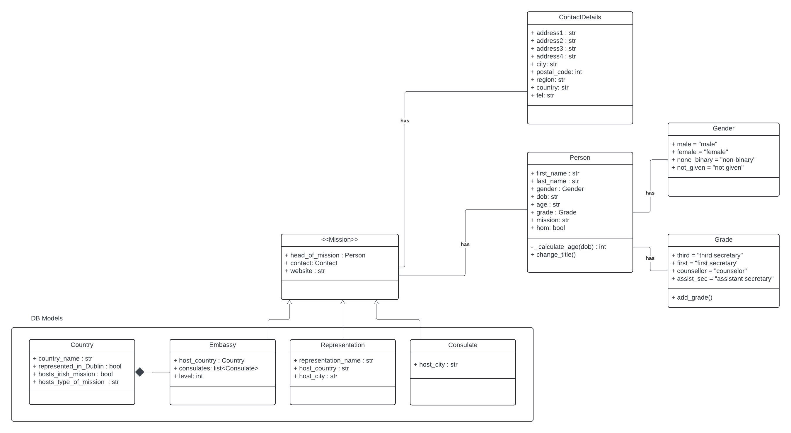

# Irish Missions Abroad 

This project is intended only as training exercise. I uses [data scraped](https://github.com/cordovez/Irish_Embassies_scrape) (using Scrapy) from a public website which lists Irish embassies abroad by country.

Countries, Embassies, Consulates, and Diplomats are saved into different MongoDG document collections and the API will serve the joined data. In other words, an embassy will be populated with its 'head of mission' (Diplomat), consulates (Consulate) and associated with a Country.

Other features may include, bilateral economic trade, distribution of diplomat's gender, etc.

## How is this a helpful exercise?
I am exploring approaches to architecture but primarily to data modelling and database design. Not only do I explore separation of concerns between the scrapper, the API and the front-end; but I also aim to find the most clear and evident way of structuring the project.

## The Document models
Basic document model is as follows:

## Disclaimer
The data used in this project is NOT intended to be taken as final nor factually correct. It was scraped from a site that is in development and I have no access to source data that may correct any errors. It is in a public repository for the benefit of potential job applications but it is not designed for public use.